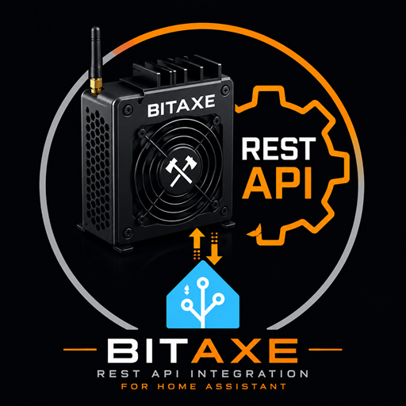

<p align="center">
  
</p>

<h1 align="center">Bitaxe Unified</h1>

<p align="center">
Complete Home Assistant integration for Bitaxe miners using the native AxeOS REST API.
</p>

<p align="center">
Control, monitor and automate your Bitaxe devices directly from Home Assistant.
</p>

---

# Features

Bitaxe Unified combines the functionality of multiple existing Bitaxe integrations into a single package with full monitoring and device control.

## Full Device Control

### Buttons

* Pause Mining
* Resume Mining
* Restart Device
* Identify Device LED

### Switches

* Mining Enable / Disable
* Auto Fan Enable / Disable

### Adjustable Settings

* ASIC Frequency
* Core Voltage
* Fan Speed
* Target Temperature

---

# Sensor Support

## ASIC Sensors

* ASIC Temperature
* ASIC Temperature 2
* VR Temperature
* ASIC Core Count
* ASIC Frequency
* ASIC Error Counter
* Error Rate
* Overheat Mode

## Hashrate Sensors

* Current Hashrate
* ASIC Hashrate
* Expected Hashrate
* 1 Minute Average
* 10 Minute Average
* 1 Hour Average
* Efficiency (J/TH)

## Power Sensors

* Power Consumption
* Current
* Input Voltage
* Nominal Voltage
* Core Voltage Target
* Core Voltage Actual
* Maximum Power Limit

## Fan Sensors

* Fan RPM
* Fan 2 RPM
* Fan Speed
* Manual Fan Speed
* Minimum Fan Speed
* Auto Fan Status

## Pool Statistics

* Shares Accepted
* Shares Rejected
* Pool Difficulty
* Pool Response Time
* Blocks Found
* Best Difficulty (Session)
* Best Difficulty (All Time)

## Bitcoin Network

* Block Height
* Network Difficulty

## Device Information

* WiFi Signal Strength
* Uptime
* Overclock Status

---

# Supported Devices

Bitaxe Unified is designed to support all current and future Bitaxe devices.

### Confirmed Devices

* Bitaxe Gamma
* Bitaxe Supra
* Bitaxe Ultra
* Bitaxe Hex

Additional models should work automatically.

---

# Installation

## HACS (Custom Repository)

1. Open HACS
2. Select **Integrations**
3. Open the three-dot menu
4. Choose **Custom repositories**
5. Add:

```
https://github.com/firstusing/Bitaxe_Unified
```

Category:

```
Integration
```

6. Install **Bitaxe Unified**
7. Restart Home Assistant
8. Add the integration
9. Enter the IP address of your Bitaxe

---

# Manual Installation

Copy:

```
custom_components/bitaxe_unified
```

to:

```
/config/custom_components/
```

Restart Home Assistant and add the integration.

---

# API Endpoints Used

Bitaxe Unified communicates locally using the native AxeOS REST API.

### Information Endpoints

```
/api/system
/api/system/info
/api/system/asic
/api/pool
/api/network
/api/swarm
```

### Control Endpoints

```
/api/system/pause
/api/system/resume
/api/system/restart
/api/system/identify
```

---

# Why Another Bitaxe Integration?

Existing Bitaxe integrations often focus on only one aspect:

* Monitoring only
* Limited controls
* Missing sensors
* Older API versions

Bitaxe Unified aims to provide:

* Full control
* Complete telemetry
* Better AxeOS compatibility
* Future Bitaxe support
* One integration instead of multiple

---

# Roadmap

### Planned Features

* Automatic mDNS discovery
* Binary sensors
* Diagnostics support
* Translation support
* Services.yaml
* Dynamic sensor discovery
* Better support for future AxeOS versions

---

# Version History

## v0.2.2

### Added

* Extended telemetry support
* Pool statistics
* Bitcoin network statistics
* Power monitoring
* Fan monitoring
* Multiple API endpoint support

### Fixed

* Entity registration issues
* Sensor description bugs
* Improved compatibility with newer Home Assistant versions

---

## v0.1.0

Initial release.

### Added

* Pause Mining
* Resume Mining
* Restart Device
* Identify Device
* Mining Switch
* Auto Fan Switch
* ASIC Frequency Control
* Core Voltage Control
* Fan Speed Control
* Target Temperature Control

---

# Contributing

Bug reports, feature requests and pull requests are welcome.

If your Bitaxe model exposes additional API fields, please open an issue so support can be added.

---

# Disclaimer

This project is not affiliated with the official Bitaxe project.

Bitaxe Unified is a community-driven Home Assistant integration.

---

# License

MIT License
